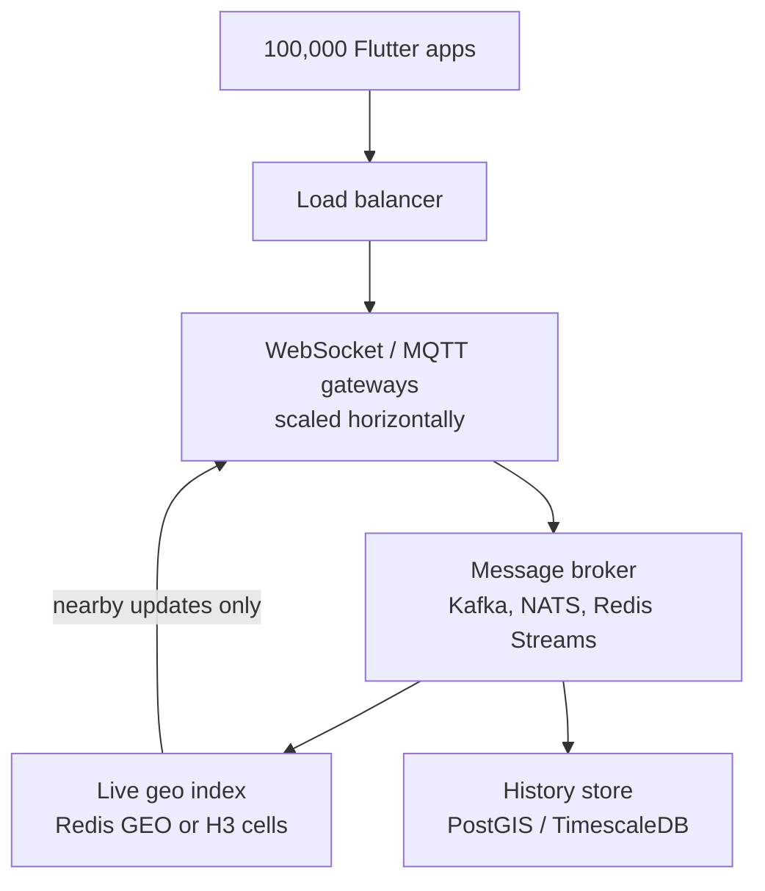
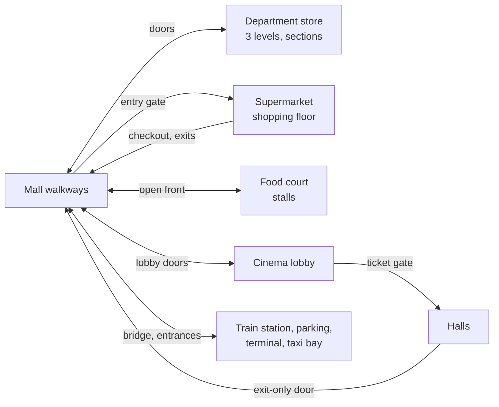

# Indoor mall navigation app: design notes and decisions

> **Background only (plan.html L110, 2026-10-07).** These notes predate the plan. The product owner ruled each conflict: positions stay on the phone (no live stream, broker, Redis or PostGIS); no crowd learning from phones; no barometer; device storage as D6; off-route 5 m in corridors and 7 m in stores (adopted from these notes); no automatic route switching; other ways keep L87's rules with these notes' labels ("via Elevator B"); a shopper browsing in a store is held, not re-routed. Scale is measured at the pilot (L109). Where these notes and the plan differ, the plan governs.

Sep 25, 2026 · @Genesis

## Purpose and key decisions

This doc records every design decision for a live-location and indoor mall navigation app built with Flutter, with the reasoning and evidence behind each. A new reader should be able to continue the work without the original conversation.

The app shows live locations and routes people through large multi-floor malls, modeled on typical Philippine malls (supermarket and department store anchors, a central atrium, cinemas on the top floor). The scale discussed is millions of registered users, with up to 100,000 navigating at the same time.

| Topic | Decision | Main reason |
| --- | --- | --- |
| Flutter state management | Riverpod 3.x; BLoC if a large team wants strict event trails | Native stream support, fine-grained rebuilds, auto-dispose |
| Client performance | Throttle GPS at the source; keep the map widget stable and update it through its controller | Rebuilds and map redraws cause jank, not the state library |
| Backend at scale | Persistent connections, a message broker, an in-memory geo index, and an async history store | Updates are sent only to people viewing that area |
| Location data | Device cache, a live server cache with expiry, and a separate history store | Each answers a different question |
| Offline | Offline-first: read and write locally, sync in the background | GPS works offline; other people's locations don't |
| Indoor routing | A\* with a floor-aware heuristic, on the device; Dijkstra for "nearest" searches | Mall graphs are small and costs change constantly |
| Deviations | Reroute from the current position, penalize the skipped path, avoid flip-flopping, offer at most 2 genuinely different alternatives | Never send people back into what they avoided |
| Complex malls | Facilities are nested maps joined at doors; each door has rules | Handles one-way doors, tickets, opening hours, and outside stations |
| Emergencies | A precomputed exit direction for every walkway point; reports are trusted immediately | A way out is ready before the alarm, even offline |

Sections follow the order of the discussion. Section 12 lists the four interactive visualizations built along the way.

## Flutter client: state management and performance

Use Riverpod 3.x. The performance gap between well-built state libraries is small; what decides smoothness is how high-frequency location updates and rebuilds are handled.

**Why Riverpod fits live location**

- `StreamProvider` wraps the GPS stream and exposes loading, data, and error states, which covers permission denials and GPS dropouts.
- `ref.watch(provider.select(...))` rebuilds a widget only when the field it uses changes, for example speed but not heading.
- Logic lives outside the widget tree and needs no `BuildContext`, so it is easy to test.
- `autoDispose` stops GPS subscriptions when nothing listens, which saves battery.

**Alternatives considered**

| Library | Verdict |
| --- | --- |
| BLoC | Equal performance, more boilerplate; best when a large team needs every change to go through an explicit, auditable event |
| Provider | Works, but Riverpod supersedes it |
| GetX | Discouraged for production because of tight coupling and maintenance concerns |

Minimal setup:

```dart
final locationProvider = StreamProvider.autoDispose<Position>((ref) {
  return Geolocator.getPositionStream(
    locationSettings: const LocationSettings(
      accuracy: LocationAccuracy.high,
      distanceFilter: 10, // emit only after moving 10 m
    ),
  );
});
```

**Practices that matter more than the library**

- Throttle at the source with `distanceFilter` and a sensible accuracy level.
- Never rebuild the map widget per GPS tick; move markers and the camera through the map controller.
- Wrap only moving parts (marker layer, speed readout) in their own `Consumer` widgets.
- Animate markers between points so a lower update rate still looks smooth.
- Move heavy work (route calculation, many geofence checks, long polylines) to an isolate with `compute` or `Isolate.run`.
- Background tracking needs a background service (for example `flutter_background_service` or an Android foreground service); the state layer receives its updates instead of owning the GPS stream.
- With many visible users: batch incoming updates, cluster markers when zoomed out, and use `select` so one update doesn't rebuild the whole list.

## Scaling to 100,000 concurrent users

The Flutter client scales automatically because every phone runs its own copy of the app; the backend is where scale becomes an engineering problem. The one client-side concern is how much data each phone receives, which the server must limit to what is on screen.

**Load math**

- 100,000 users sending a position every 5 s = about 20,000 updates per second; every 1 s = 100,000 per second.
- At 100 to 200 bytes per update, incoming bandwidth is only a few MB/s.
- The hard part is fan-out. If everyone saw everyone, one round of updates would be 100,000 × 100,000 = 10 billion messages.
- The fix is spatial partitioning: split the map into grid cells (H3 or geohash) and send each update only to users watching that cell.



Updates flow down to the broker; the geo index sends each one back only to gateways serving users in that area.

**Layer by layer**

- **Persistent connections.** WebSocket or MQTT instead of an HTTP request per update. A tuned gateway (Go, Elixir, Node) holds tens of thousands of connections; keep gateways stateless.
- **Hot vs cold data.** Latest positions live in memory; history is written in batches through the broker so slow disk writes never delay live updates.
- **Subscribe by area.** The app subscribes to the cells in its viewport and changes subscriptions as the user pans or zooms.
- **Adaptive update rate.** Send often while moving, rarely while stationary (activity recognition or speed); this can cut load by half or more and saves battery.

**Client changes at scale**

- Send only changed fields; cluster markers when zoomed out.
- Apply incoming updates to state in batches (for example every 500 ms).
- Reconnect with exponential backoff and random jitter so 20,000 phones don't reconnect in the same instant after a gateway restart.

**Managed services and cost**

Firebase, Supabase Realtime, Ably, and AWS IoT Core can run the connection and pub/sub layers. Per-write pricing gets expensive: 20,000 writes per second is about 1.7 billion writes per day, which can cost thousands of dollars daily. A common path is to start managed and move the high-volume location path to your own infrastructure later.

Load test before launch with simulated devices (k6, Gatling, or Locust); the first bottleneck is often unexpected, such as a database connection pool or a single Redis instance.

## Caching, location history, and saved places

Use both a cache and history, because they answer different questions: "where is this user now?" and "where have they been?" Saved places are a third kind of data, permanent and owned by the user.

| Store | Holds | Technology | Rules |
| --- | --- | --- | --- |
| Device cache | Last known position, saved places, unsent updates | `shared_preferences` for one value; Drift, Isar, or sqflite for more | Shows the map instantly on launch; queues updates while offline |
| Live server cache | One latest position per user, overwritten on each update | Redis GEO or H3 cells | Expire entries after a few minutes so offline users disappear instead of freezing |
| History | Every update, append-only | PostGIS, TimescaleDB, or partitioned PostgreSQL, written in batches via the broker | Powers replays, delivery proof, analytics, disputes |
| Saved places | Home, office, favorites | Main database tied to the account, copied to the device | Survives reinstalls and syncs across devices |

**Keep history from exploding.** At 100,000 users every 5 s, raw history grows by about 1.7 billion rows per day. Keep full detail for 7 to 30 days, then downsample (one point per minute) or simplify tracks with Douglas–Peucker. Partition tables by day or week so old data is cheap to drop.

**Privacy.** Location history can reveal where someone lives, works, and worships. Store only what features need, set retention limits, encrypt it, get explicit consent, and let users view and delete their history. GDPR and many national data privacy laws require these practices; check the rules where your users are.

## Offline behavior

The app works partly offline: GPS needs no internet, but anything involving other users or online services does. Design it offline-first, so the app always reads and writes locally and the network is a background sync layer.

| Works offline | Needs internet |
| --- | --- |
| Own position on a cached map | Seeing other users live |
| Recording a trip to the local database | Sending your position to others (queued until online) |
| Saved places and downloaded history | Address search and geocoding |
| Distance and speed calculations | Server-based routing |
| Geofencing (runs on the device on Android and iOS) | Online map tiles |

Without internet the phone loses assisted GPS, so the first fix can take several seconds to a few minutes instead of 1 to 2 s. Tracking is normal after that.

**How to make it work**

- **Map tiles on the device.** `flutter_map` with `flutter_map_tile_caching`, or Mapbox offline regions. Check the tile provider's terms: OpenStreetMap's public servers forbid bulk downloads. Limit area and zoom, since a city at street detail can take hundreds of MB.
- **Store and forward.** Save each point locally with a timestamp and a unique ID; upload in time order when back online. Unique IDs let the server drop duplicates on retries.
- **Real connectivity checks.** `connectivity_plus` only reports Wi-Fi or mobile data, not working internet. Confirm with a small request to your server or `internet_connection_checker_plus`, exposed as a Riverpod `StreamProvider`.
- **Honest offline UI.** Show an offline indicator and label other users "last seen 4 minutes ago". On reconnect, sync the queue first, then refresh live data.

## Pathfinding algorithms and how they work

Routing runs on a graph: junctions, doors, and points of interest are nodes; walkable connections are edges weighted by travel time, not distance. The graph also needs one-way edges, turn or door restrictions, and floor connections. Outdoors, OpenStreetMap is the usual source.

| Algorithm | Setup | Query speed | Handles changing costs | Best for |
| --- | --- | --- | --- | --- |
| Dijkstra | None | Slow | Easily | Small graphs, "nearest X" searches |
| A\* | None | Moderate | Easily | Venues, campuses, small cities |
| Bidirectional A\* | None | Moderate to fast | Easily | Medium networks without setup |
| ALT | Light | Fast | Moderately | Networks with occasional cost changes |
| Contraction hierarchies | Heavy | Fastest | Poorly | Country-scale routing with fixed costs |
| CRP / MLD (multi-level) | Medium | Very fast | Quickly | Large networks with live traffic |

**How each works**

- **Dijkstra** repeatedly settles the cheapest unsettled node and updates its neighbors. The first time it settles the destination, that cost is optimal. It spreads evenly in all directions, including away from the goal.
- **A**\* ranks nodes by cost so far plus a heuristic estimate of the remaining cost, so it stretches toward the goal. It stays optimal if the heuristic never overestimates (straight-line or floor-plan distance qualifies).
- **Bidirectional search** runs one search from the start and one backward from the destination and stops where they meet. Two half-radius searches cover roughly half the area.
- **ALT** precomputes true distances from a few landmark nodes. The triangle inequality then gives a lower bound on the remaining distance that accounts for walls and detours, which sharpens A\*.
- **Contraction hierarchies** rank nodes by importance and remove them one by one, adding shortcut edges where needed. Queries only climb toward more important nodes from both ends, then shortcuts are unpacked. Any cost change can invalidate shortcuts.
- **Multi-level methods (CRP, MLD)** split the map into nested regions and precompute costs between region borders. Queries cross the middle via those costs; a cost change only requires recomputing the affected regions, in seconds.

**Related pieces**

- **Map matching** snaps noisy GPS points to the most likely path, usually with a Hidden Markov Model and the Viterbi algorithm.
- **Rerouting** runs a new query from the current position after several off-route points.
- **Public transit** uses timetable algorithms such as RAPTOR or the Connection Scan Algorithm.
- **Engines:** OSRM (CH and MLD), GraphHopper (CH and landmarks), Valhalla (tiled, good for offline), or hosted APIs (Google Routes, Mapbox Directions) with per-request costs.

## Indoor multi-floor mall routing: evidence and recommendation

Use A\* with a floor-aware heuristic, run on the device, and Dijkstra for "nearest" searches. Millions of users don't enlarge a mall's graph; they only add queries, and those are independent and cheap.

**Benchmark method.** A synthetic 4-floor mall with a 1 m walkable grid, store blocks, an atrium void on upper floors, and escalators, stairs, and elevators with different costs. Two sizes: regular (5,406 nodes) and mega (48,654 nodes, 9 times larger). 3,000 random routes; every algorithm matched Dijkstra's distance on every route. Single-core JavaScript in a cloud container, so absolute times are pessimistic; compare them relative to each other.

| Algorithm | Setup (regular / mega) | Query, regular | Query, mega | Nodes explored cross-floor (regular) |
| --- | --- | --- | --- | --- |
| Dijkstra | None | 240–283 µs | 2,772 µs | 3,279 |
| Bidirectional | None | 153 µs | 1,543 µs | 1,803 |
| A\* | None | 50 µs | 191 µs | 536 |
| ALT, 16 landmarks | 37 ms / 144 ms | 44 µs | 264 µs | 188 |
| Contraction hierarchies | 0.5 s / 6.7 s | 23 µs | 89 µs | 95 |
| Multi-level, 1 level only | 40 ms / 1 s | 100–144 µs | 1,545 µs | 636–1,928 |
| Full distance table | 3 s / about 4 min | Instant lookup | Instant lookup | none |

**Evidence for and against each**

- **Dijkstra.** For: simplest, always optimal, natural for "nearest restroom". Against: explored about 60% of the mall on cross-floor routes; 5 to 15 times slower than A\*.
- **A*.*\* For: 5 to 14 times faster than Dijkstra with zero setup; closures and profiles apply instantly. Against: cross-floor routes explored 4.4 times more nodes than same-floor (536 vs 122), a weakness indoor robotics research also reports for multi-story buildings. Optimality held on all routes because the heuristic (floor-plan distance plus the cheapest cost per floor change) never overestimates.
- **Bidirectional.** Only about 1.8 times faster than Dijkstra and slower than A\*; one-way escalators require a reversed graph.
- **ALT.** For: fixed A\*'s cross-floor weakness (536 to 188 nodes) and stayed correct after closures without recomputing, since costs only rose (200 vs 443 nodes). Against: only 12% faster than A\* on the regular mall and 38% slower on the mega mall, because checking 16 landmarks per step costs time. For the accessible profile, the original landmarks were slower than A\* (137 vs 104 µs); profile-specific landmarks fixed it (58 µs) but must be stored per profile.
- **Contraction hierarchies.** For: fastest, about 2 times faster than A\*; research by Storandt shows CH also works on grid graphs. Against: nearly doubled the edge count (8,418 shortcuts on 9,443 edges), every closure means a rebuild (548 ms), and every profile needs its own hierarchy. The CRP authors note hierarchy methods are much less efficient for cost functions other than driving time.
- **Multi-level.** For: floors and wings are natural regions joined by a few connectors; re-customizing two regions after a closure took 2.3 ms. CRP handles new metrics in under a second and powers Bing Maps. Against: the simple 1-level version was 2 to 8 times slower than A\*; a full version is the most complex to build.
- **Distance table.** Instant queries, but 117 MB for the regular mall and about 9.5 GB for the mega mall, rebuilt on every closure; not viable on phones.
- **A tempting heuristic that backfired.** Adding the walk to the nearest escalator made cross-floor queries 1.5 to 2.4 times slower, because it pulled searches to the wrong connector. Benchmark heuristic changes before trusting them.

On a small 2D demo grid (400 random routes), average nodes explored were A\* 28, ALT 27, CH 49, multi-level 112, bidirectional 163, Dijkstra 224. On small graphs, setup-heavy methods don't pay off.

**Does speed matter at millions of users?** Assume 100,000 people navigating at the peak, each requesting a route plus a reroute about once a minute: roughly 1,700 queries per second. One core running A\* handles about 20,000 per second on a regular mall and 5,000 on a mega mall. Mobile round trips take tens to hundreds of milliseconds, so 23 vs 50 µs is invisible, and on-device routing costs the server nothing.

| Criterion | Dijkstra | A\* | Bidir. | ALT | CH | Multi-level | Table |
| --- | --- | --- | --- | --- | --- | --- | --- |
| Query speed | Poor | Good | Fair | Good small, fair large | Best | Fair | Best |
| Multi-floor routes | Fair | Fair | Fair | Good | Good | Good | Good |
| Closures and crowding | Good | Good | Good | Good | Poor | Good | Poor |
| Accessibility profiles | Good | Good | Good | Fair | Poor | Good | Poor |
| Memory and on-device use | Good | Good | Good | Fair | Fair | Fair | Poor |
| Implementation effort | Good | Good | Fair | Fair | Poor | Poor | Good |
| "Nearest" searches | Best | Poor | Poor | Poor | Poor | Poor | Good |

Most weight goes to closures, profiles, and implementation effort, since those change daily and bugs hurt users directly. Revisit the choice for server-side routing in huge complexes (mall plus airport or transit hub, hundreds of thousands of nodes): CH if closures are rare, multi-level or Customizable Contraction Hierarchies if updates and profiles are frequent.

Published work referenced during the discussion: Bast et al., Route Planning in Transportation Networks (survey); Delling et al., Customizable Route Planning; Storandt, contraction hierarchies on grid graphs; an MDPI study on multi-story robot navigation. These were cited from search results and not re-verified for this doc.

## Rerouting when users deviate

Treat a deviation as information about the mall, not an error: reroute quietly from where the user is, penalize the path they avoided, and offer alternatives only when they help.

1. **Confirm the deviation.** Indoor positioning is off by a few meters, so one stray fix means little. Require about 3 consecutive fixes more than 5 m from the route (looser inside stores, where positioning is worse). Floor changes come from the barometer and position together.
2. **Reroute without sending them back.** Multiply the cost of the skipped segment (4 times in the visualizations) for this trip, then run A\* from the current position. A penalty, not a removal, because the user may have detoured to shop.
3. **Avoid flip-flopping.** Switch routes automatically only if the new one saves at least 10 s or 10%. Otherwise keep the current route.
4. **Offer meaningful alternatives.** Literal second and third shortest paths are usually the same route shifted by one tile. Use the penalty method: raise costs along the best route, run A\* again, keep results that share at most about 60% with it and are no more than 25 to 40% longer. Show at most 1 or 2, labeled by what differs ("via Elevator B", "past the Bookstore"). Show them at trip start, when the user taps "Path blocked" or "Avoid this area", or after a second deviation.

**Learning from many users**

- One user avoiding a corridor may be preference; many users turning back at the same spot within minutes suggests an unreported blockage.
- Count turn-backs around the spot where they happened, raise that area's cost for everyone, and alert staff when a threshold is reached (5 reports in the visualization).
- Estimate crowding from device density and speed, and add it as a temporary cost.
- Let learned penalties fade (halving about every 10 minutes) unless new reports confirm them. Staff confirmation always overrides inferred data.
- Store only counts per walkway segment over time, not individual movement histories.

**Edge cases**

- **Destination unreachable:** say so plainly and offer another entrance or a nearby alternative.
- **One-way escalators:** reroutes must respect direction.
- **Step-free users:** penalties only reorder allowed routes; they never push someone onto stairs.
- **Impossible jumps:** wait for confirmation before rerouting on a position that couldn't be reached in the elapsed time.

This favors A\* further: costs change per user and per minute, and A\* needs no setup to use them. ALT tolerates rising costs, contraction hierarchies can't handle per-user penalties, and multi-level routing can update only affected zones.

## Complex mall maps: nested facilities and door rules

Model the mall as separate maps joined at doors: the mall walkways, each facility's inside map, and places outside the building. Each door carries rules checked for the time the user would reach it, and one A\* search runs over the joined graph.



Arrows show which directions each join allows; one-way doors and gates make the way in and the way out differ.

**Facilities in the model**

| Facility | Inside map | Doors and rules |
| --- | --- | --- |
| Department store (L1–L3) | Four sections per level with racks, its own escalators | Mall doors on each level, a street entrance, a short bridge to the train station; open 10:00–21:00 |
| Supermarket (L1) | Shelves, entrance turnstile, checkout lanes | Entry-only gate, exit-only doors, one-way side exit to the taxi bay; checkout adds waiting time; open 9:00–22:00 |
| Food court (L2) | Four stalls and tables | Open front; used only as a start or destination |
| Cinemas (L3) | Lobby, ticket counter, snack bar, four halls | Lobby doors; ticket gate into the halls; exit-only door back to the mall |
| Outside stations | Train station, parking building, transport terminal, taxi bay | Linked by bridges or entrances; the mall is open 10:00–22:00 |

**Rules and behaviors**

- **Choosing a whole facility** routes to the nearest usable entrance (a multi-target search). Choosing a section routes through a door and then inside.
- **One-way doors** are compiled into the graph, so routes can enter one way and leave another.
- **Tickets:** without one, the route stops at the ticket counter first (a two-leg route).
- **Opening hours only stop people going in, never going out.** Someone inside a store at closing can still leave.
- **Shortcuts through stores** are allowed only for facilities that permit walking through (the department store here), when the user allows shortcuts, and only if they would leave before it closes. Facilities the trip starts or ends in are always allowed.
- **Exits that lead elsewhere** (a bridge to a station, a side exit to a taxi bay) are ordinary edges with their own costs and rules.
- **Directions are hierarchical:** "Enter the Department store through its Level 2 mall entrance", "Pay at a checkout lane (about 1 min in line)", "Cross the short bridge to the Train station".

In tests, a store closing at 21:00 was skipped as a shortcut when the user would still be inside it, and the note explained the lost 9 seconds. The supermarket's side exit correctly could not be used to enter.

## Restrooms, uncertain start positions, and unexpected behavior

**Restrooms (CR) and services.** Earlier versions had restrooms only as unlabeled blocks. The model now has 12 restrooms: 6 on the mall walkways, CRs inside the department store, food court, and cinema lobby, and an accessible CR on every level. It also has an information desk, first aid station, security office, nursing room, and prayer room. "Nearest CR" searches all 12 at once and still follows door rules, so a CR inside a closed store is skipped. A search for "CR", "restroom", "toilet", or "comfort" finds them.

**Starting from an uncertain position.** Real apps start from an estimate that can be several meters off, a common cause of bad directions. Match the estimate to the map with these rules:

- Inside a store with no inside map: start at that store's door.
- Inside a facility with an inside map: snap to the nearest aisle in the same facility, never to the corridor across the wall.
- On a shelf or rack: snap to the nearest walkable point in the same facility.
- Floor unclear: treat the route as provisional until 2 fixes agree on the floor.
- Existing rules still apply: a shopper on the supermarket floor must pass a checkout, one past the ticket gate can leave without a ticket, one inside a closed store can walk out.

**Unexpected behavior and the response to each**

| Behavior | Signal | Response |
| --- | --- | --- |
| Walks off the route | 3 fixes in a row beyond the threshold | Reroute; penalize the skipped path |
| Passes a door or station not on the route | Door beacon or entry sensor (exact) | Reroute immediately |
| Goes to the wrong floor | Barometer plus Wi-Fi | Reroute immediately |
| Stops in a store | Fixes stay in one spot | Treat as browsing; hold rerouting; resume when they move |
| Walks back the way they came | Fixes on the route but moving backward, 3 in a row | Replan from here instead of repeating "turn around" |
| Loses signal | No fixes | Keep the route; estimate progress by step counting |
| Position jumps far away | Implied speed or floor change impossible | Ignore the fix; one bad fix never reroutes |
| Ignores the app | Keeps diverging | Keep an updated route ready; don't nag; adopt it when they pass a door or look again |
| Reports the way ahead | User tap | Mark it blocked for them at once; warn others until staff check |

Thresholds used in the visualizations: 5 m off route in corridors and about 7 m inside stores, with fixes every 1.5 s.

## Emergency evacuation and reporting

Keep a way out ready for every walkway point before any alarm: run one search backward from all safe exits, so each point stores its next step out and its time to safety. For the 2,498-point model this took about 1 to 3 ms, works offline once downloaded, and is rebuilt after every report or closure.

**What changes in evacuation mode**

- The destination becomes the nearest safe exit from wherever the user is (assembly area, transport terminal, taxi bay, parking building).
- Elevators are excluded. Stopped escalators can be walked, at a higher cost.
- Fire stairs and alarmed exits unlock and join the graph.
- Store rules are suspended: one-way doors, ticket gates, checkout lanes, and opening hours no longer restrict movement.
- **Step-free users:** on upper floors the route ends at a refuge area beside a fire stair, and responders are told the user's location.

**Reporting blockages and out-of-order paths**

- Users can report a blocked path or an out-of-order stair, escalator, or elevator from the map or with "Report the way ahead".
- During an emergency a report counts immediately, before staff confirm it, because a false report costs seconds and a missed one could cost lives.
- The exit field is rebuilt at once (under 1 ms in tests), so everyone heading that way gets a new exit immediately.
- A shopper who sees an obstacle reports the whole blockage in one tap, so they aren't routed into its edge again.
- Outside emergencies, a report blocks that path for the reporter at once and shows others a warning until staff check it.

In the tested scenario, a shopper in Cinema Hall 3 found the west fire stair blocked. After one report, the route switched to the cinema's exit-only door and Stairs A to the assembly area.

## Visualizations built

Three published interactive pages build on each other; each later page started from a copy of the earlier one, and the originals were left unchanged.

| Page | What it shows | Key interactions |
| --- | --- | --- |
| [Finding the way through a three-level mall](https://claude.ai/artifact/AkBLCaLcgBEvtd5j4fEU2Q) | The six algorithms on a three-level mall with one-way escalators and elevator waiting time | Preset trips or click to pick points; one algorithm at a time with live query times; "race all six"; step-free toggle; nearest-restroom demo |
| [When a shopper leaves the route](https://claude.ai/artifact/Ebu52Zamu3ZbLcq1DyPcdo) | Deviation detection from noisy fixes, penalties on skipped paths, flip-flop prevention, alternatives, learning from other shoppers | Place unreported obstacles, crowds, staff closures; "Take a different way"; send batches of 30 shoppers; skip ahead to watch penalties fade; staff alert |
| [Stores inside stores, doors to other places](https://claude.ai/artifact/1yD6DXLsJ4bTatdzkcDLFn) | Nested facilities, door rules, outside stations, CRs and services, random starts, unexpected moves, evacuation | Searchable directory; time slider; ticket, shortcut, step-free, and checkout-line settings; 10 scenarios; 7 unexpected-move buttons; evacuation mode with shopper reports |

Earlier in the conversation, inline diagrams showed the backend architecture and 2D grid demos comparing Dijkstra, A\*, and bidirectional search, then all six algorithms. Those lived only in the chat.

**Model assumptions shared by all pages**

- A modeled layout inspired by typical Philippine malls, not the floor plan of an actual branch.
- One grid square is about 2 m; walking speed 1.25 m/s.
- Escalator ride 25 s; stairs 20 s per floor; elevators about 60 s of waiting plus 10 s per floor.
- Escalators run one way; the up and down escalators are separate.
- Position fixes have about 2 m of random error (more inside stores) and arrive every 1.5 s.
- Routing in the last two pages is A\*; the evacuation mode uses the precomputed exit field.

## Caveats and next steps

The recommendations rest on synthetic models and single-core JavaScript benchmarks, so validate them against a real mall's map and real positioning before committing.

**Caveats**

- Benchmarks used a synthetic mall and simple implementations; production engines in C++ or Dart isolates will be faster in absolute terms.
- The benchmark modeled escalators as two-way; the visualizations model them correctly as one-way.
- The multi-level implementation had only one level, which understates what a full CRP or MLD version can do.
- Published research was cited from search results during the discussion and not re-verified here.
- Indoor positioning is likely the hardest part. GPS is weak indoors, so real deployments rely on Bluetooth beacons, Wi-Fi positioning, UWB, pedestrian dead reckoning, and the barometer for floors.

**Open questions**

- Which positioning technology will each mall support, and what accuracy does it give per floor?
- Where will map data come from, and in what format (for example, Apple's IMDF or OpenStreetMap indoor tagging)?
- Who maintains door rules, opening hours, and closures, and through what admin tool?
- What do local fire codes require for refuge areas, exit signage, and evacuation guidance?
- How many reports should confirm a blockage outside emergencies, and how fast should penalties fade in practice?

**Suggested next steps**

- [ ] Build the nested graph (walkways, facilities, doors, rules) from one real floor plan.
- [ ] Implement A\* and the evacuation field in Dart, running in an isolate, and benchmark on mid-range phones.
- [ ] Pick a positioning approach and field-test the deviation thresholds (5 m, 3 fixes) in a live mall.
- [ ] Load test the backend with simulated devices before launch.
- [ ] Review privacy, retention, and consent with legal before storing any location history.
